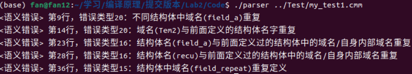
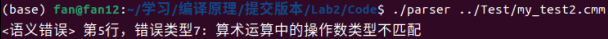
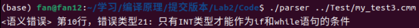

# 编译原理实验一：C--语言的语义分析
<div align="right">
    <font face="KaiTi" size="4">
        软件工程 范兆基 20331011 819402765@qq.com
    </font>
</div>

## 一、功能简述
1. 实现了满足C--语言各假设的语义分析
2. 可以检查出实验要求中的17种语义错误(部分错误类型进行了修改，与C--语言的假设更匹配)与2种额外的语义错误
   - 错误类型 3：变量出现重复定义，或变量与前面定义过的结构体名字**或结构体域名**重复
   -  错误类型16：结构体的名字与前面定义过的结构体或变量的名字重复，**或结构体与前面定义过的结构体中的域名/自身内部域名重复**
   -  错误类型20：不同结构体中域名重复，域名与前面定义过的结构体或变量的名字重复
   -  错误类型21：只有INT类型才能作为if和while语句的条件
3. 实现了要求二(变量的定义受可嵌套作用域的影响)和要求二(将结构体间的类型等价机制由名等价改为结构等价)

## 二、代码实现
### 1. 底层数据结构
- 语法树节点：语法树节点包含与语法分析有关的节点属性
```C
struct Node
{
    int tag;
    char* name;// 类型名称或标识符名称； 根据tag而定
    struct Node *kids[10];// kid nodes
    int kid_num;
    Value value;
    int level;// node_height
    int row;
    int if_empty;
    enum Generation_Type generation;// 产生式类型，用于计算继承属性
    Type inh_type;// 继承下来的类型
    Type return_type;// 函数的返回值类型
    Type type;// 节点类型,功能多样: 记录变量/式子类型，确定结构体内部类型
    enum {LEFT,RIGHT} l_r;// 左值右值 
    Common struct_specifier;// Common表中的对应的结构体条目
    int if_structspecifier;// 记录一个Specifier是否为StructSpecifier
    enum ID_Type id_type;// 记录一个ID所代表的的含义
    enum {DEF,USE} id_usage;// 记录一个ID的用处
};
```

- 类型记录
```C
// 若类型是结构体，那么就根据FieldList是否为空判断一个结构体类型是否被找完
struct Type_
{
    enum { BASIC, ARRAY, STRUCTURE, UNKNOWN } kind;
    union
    {
        // 基本类型
        int basic;
        // 数组类型信息包括元素类型与数组大小构成
        struct { Type elem; int size; } array;
        // 结构体类型信息是一个链表
        FieldList structure;
    } u;
};


// 域结构体
struct FieldList_
{
    char* name; // 域的名字
    Type type; // 域的类型
    FieldList tail; // 下一个域
};
```
- 符号表条目
此处为什么要分成两个符号表：变量的定义受可嵌套作用域的影响，将变量单独隔离出来后面好处理
```C
// 一般符号表结构体
struct Common_
{
    char* name;// 结构体名字
    enum ID_Type kind;// 结构体/域/函数
    /*
        若为STRU，则type记录--这种结构体的结构
        若为FUNC，则type记录--返回值和参数
    */
    Type type;// 结构体域
    Common nxt_common;

};

// 变量符号表结构体
struct Var_
{
    char* name;// 符号名称
    Type type;
    Var nxt_var;
    unsigned hash;
};
```

- 作用域：与符号表结构体形成十字链表以变量的嵌套作用域
```C
// 作用域结构体
struct Domain_Item_
{
    Var var;
    Domain_Item nxt_item;
};
```
2. 符号表实现
- 一般符号表：使用散列表
- 变量符号表：使用十字链表(与实验二指导中相同)
- 相同哈希值的变量用一个链表串联，同一个作用域的变量用一个链表串联，形成交叉
- 作用域嵌套**最多10层**(设定为一个大小为10的数组)，超出会进行报错并终止程序

3. 属性计算过程
总体的属性计算是在遍历语法树的过程中进行
```C
void r_s(struct Node* nd)
{
    // 空节点不遍历
    if(nd->if_empty==1)
    {
        return;
    }
     
    int i,kid_num = nd->kid_num;
    
    for(i = 0; i < kid_num;i++)
    {
        // 处理继承属性
        inherited(nd->kids[i],nd);
        r_s(nd->kids[i]);
    }

    // 处理综合属性
    synthesized(nd);
}

// 语义分析入口
void recursive_semantic(struct Node* nd)
{
    if(nd==NULL)
    {
        fprintf(stderr, "Fail building syntax tree\n");
        return;
    }
    // 初始化设置
    init_semantics();
    nd->level = 0;
    r_s(nd);
}
```
4. 语义分析摘选
该代码涉及的语义分析内容较多，这里挑选较重要/踩过坑的内容进行说明
- 重要属性介绍
  - ``Type inh_type``:从先前节点继承而来的属性
    - 处理数组类型，将基类型传至底部，再往上不断组装
    - 记录变量的类型并不断传递往下
      例：``Specifier DecList``，Specifier中的类型影响DecList中变量的影响类型，那DecList中的``inh_type``就是Specifier对应的类型，并会继续将这个类型继续往下传递。  

    - ``enum ID_Type id_type;``：记录ID的类型(变量、域、函数、结构体)
- 实验要求的错误类型15：结构体中域名重复定义（指同一结构体中）
    这里着重指明同一结构体中的域，所以需要区分出当前结构体的域和非当前结构体的域。
    我的做法是先把当前结构体中的域缓存起来(代码中用一个``struct_cache``的链头进行存放)，直到结构体定义结束才将缓存中的符号表条目插入整体的符号表中。这样便可以满足上述的要求。
- 参数列表
  想要知道参数列表，就要将底层的ID类型和名称收集起来并向上传递。本代码中利用``Type_``这个表示类型的结构体进行存储，将参数列表整体看做是一个结构体，每个参数是一个域。在自底向上的过程中每遇到一个参数，就往结构体中加一个域，最终形成一个完成的参数列表。
- 符号表条目的插入时机
  插入时机不应选取在ID的综合属性计算阶段。对于一个数组变量而言，ID的综合属性阶段只能知道它的基属性，并无法知道它的维度和大小，从而产生错误。实际上在本代码中，符号表条目的插入基本都是在较高层次的地方进行，这些地方的信息要比最底层的ID多一些，更方便构建符号表条目。
- UNKNOWN类型
  对于一些例如``INT+FLOAT``的表达式，我们无法确定其真正的类型，但是不指定或随意指定其类型有很可能导致无法继续后面的语义分析或者出现没必要的连环报错。
  在本代码中，引入了一个UNKNOWN类型，这个类型是一个万能类型，可以进行任意运算、数组取元素、结构提取域，所得类型也还是UNKNOWN类型，并且可认为与任意类型等价，从而解决了上述问题。
- 


## 五、代码编译与运行
1. 代码编译：进入Code目录下执行make命令，会在该目录下产生相应可执行文件parser
2. 代码测试：编译完成得到parser文件后，在Code目录下执行make test命令，会自动测试Test目录下的所有文件

## 六、补充测试样例
因为本代码对错误类型进行了一些修改和补充，并且还引入了UNKNOWN类型，所以使用补充测试样例进行测试
- 有关结构体域的测试(这个样例略长，涵盖大部分的域相关的错误)
    ```C
    struct Tem1
    {
        int field_a,field_b;
        float field_f;
    };

    struct Tem2
    {
        int field_a;
    };

    struct Tem3
    {
        int Tem2;
    };

    struct Tem4
    {
        int field_4_a;
        struct Tem1 field_4;
    };

    struct field_a
    {

    };

    struct recu
    {
        int recu;
    };

    struct repeat
    {
        int field_repeat;
        float field_repeat;
    };

    int main()
    {
        struct Tem1 t1;
        struct Tem4 t4;
        t4.field_4 = t1;
    }
    ``` 
   

- 有关UNKNOWN的测试
    ```C
    int main()
    {
        int a,b,c;
        float f;
        f = a + 0.5;
    }
    ``` 
  

- 有关if/while的测试
    ```C
    int main()
    {
        int i;
        float f;
        if(i)
        {
            int j;
        }

        while(f)
        {
            f = f + 0.5;
        }
    }
    ``` 
    

## 七、实验总结
相比于实验一，实验二的难度上升了不少。
实验一的主要困难在于不清楚flex和bison的语法，在熟悉语法方面花费时间较多。
实验二的困难首先就在于你要把整个代码的框架、语义规则想好。这一步就已经花了我 2 天时间。但是所得初步框架还是不够完善。在后续的编码过程中仍需要对框架进行修改。但好在两天时间想出的框架已经足以支撑大部分的功能，后续的改动也不算很大；此外，繁重的代码量也是其中一大困难。1700多行代码完全是由自己设计、编程，除了实验指导之外没有参考任何资料，全心全意花了整整9天才算完成了一份差强人意的代码。(如果有后来人需要参考我代码的话，希望你能为我的仓库点一个star，谢谢！)


