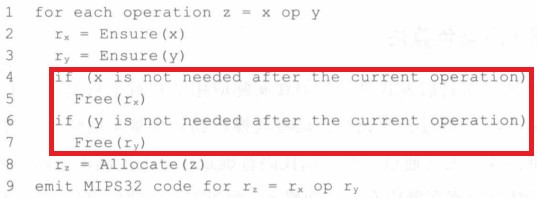
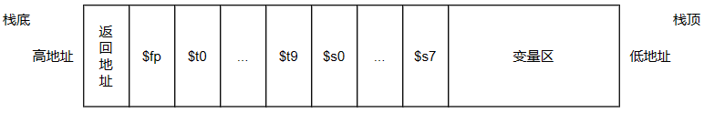

# 编译原理实验四：C--语言的目标代码生成
<div align="right">
    <font face="KaiTi" size="4">
        软件工程 范兆基 20331011 819402765@qq.com
    </font>
</div>

## 始、报告简述
- 本次实验的基本依据是实验指导，此实验报告主要记录我在实验过程的额外思考内容。
## 一、底层数据结构
### 1.1 MIP指令操作数
```C
// 寄存器结构体
struct Register_
{
    int ID;
    struct
    {
        enum { zero_REG,at_REG,a_REG,v_REG,t_REG,s_REG,k_REG,
            gp_REG,sp_REG,fp_REG,ra_REG } kind;// 具体含义看实践指导
        int no;
    } alias;
};

// MIP操作数结构体
struct Mip_Operand_
{
    enum {REG,CONSTANT_MIP,FUNC_MIP} mip_ope_kind;
    union 
    {
        struct Register_ reg;// 寄存器
        struct {int value;int if_label;} const_;// 常数值或者label号码时
        char* func_name;// 记录函数名称
    } u;
    
};
```

### 1.2 MIP指令
```C
// MIP指令列表结构体
struct Mip_
{
    enum {nop_MIP,label_MIP,func_MIP,li_MIP,move_MIP,addi_MIP,subu_MIP,add_MIP,sub_MIP,mul_MIP,div_MIP,
        mflo_MIP,lw_MIP,sw_MIP,j_MIP,jal_MIP,jr_MIP,beq_MIP,bne_MIP,bgt_MIP,blt_MIP,bge_MIP,ble_MIP} mip_kind;
    Mip_Operand orerands[3];
};

// 再形成链表
struct Mips_List_
{
    struct Mip_ mip;
    // Mips_List prev;
    Mips_List nxt;
};
```
### 1.3 变量描述符
```C
// 变量描述符结构体
struct Var_Desc_
{
    unsigned int hash;// 使用哈希值区分不同的变量(临时和局部)
    int reg_tag;// 存放存储在哪个寄存器中
    int bia;// 相对于sp/fp指针的偏移量
};
```

## 二、寄存器分配方法
- 寄存器分配方法基本与实验指导相同，但少实现了红框部分
 


## 三、IR操作数转化与过渡寄存器
- 本代码会生成类似的中间代码：$v1 := \&v2 \ + 1 、v1 \ := *t1 \ + 5$，我们不能直接使用某一条MIP指令来翻译上述形式的IR，因为类似于$*t1、\&v3$ 的**位于赋值符号右侧**的IR操作数无法通过简单的寄存器分配转化成MIP操作数，需要通过**多条指令**得到其真实值
- 我采用了过渡寄存器的方式来翻译上述代码,使用固定的过渡寄存器来存储$*t1、\&v1$所代表的真实值
  - 如果不使用既定的寄存器，在本代码中可能会导致寄存器分配的碰撞
    - 以 $v1 := *t1 \ + t2$ 为例，假设 $*t1$ 的值存放到寄存器 $\$t0$ ，但此时不能说寄存器 $\$t0$ 中存储了某个变量的值(  $\$t0$ 存储了 $*t1$ ，没有存储 $t1$ )
    - 在这样的情况下，变量 $t2$ 可能会被分配得到寄存器 $\$t0$，这样 $*t1$ 的值就被覆盖掉了
  - 而过渡寄存器只用于存放解引用、取地址的中间值，不会被其他用途的变量使用；而且本代码在进行IR语句翻译时，使用过渡寄存器后会立即使用其中的值，而且过渡寄存器中的值也只需要使用一次，故后续被覆盖也无所谓
  - 我指定 $\$t8$ 和 $\$9$ 为过渡寄存器，原本是想使用 $\$at$ 和 $\$v1$，但QTSpim不允许我使用 $\$at$，有一点点强迫症的我干脆把 $\$v1$ 也换了
  - 用途
    - 对于解引用形式( $*t1$ )，利用lw指令将真正的内存中的值存放到过渡寄存器中
    - 对于取地址形式( $\&v1$ )，利用$add\ \ \ reg\ \ \ offset_{v1}\ \ \ \$fp$指令将 $v1$ 所对应的地址存放到过渡寄存器中
    - 过渡寄存器也用于翻译 $mul$ 和 $div$ IR语句

## 四、活动记录空间分布
- 活动记录空间分布图

- 有关变量的空间位置的确定
  - 偏移量cur_bia初始化为0，从前往后扫描某个函数中的所有局部变量和临时变量，每次遇到一个新的变量，设置该变量的偏移量为cur_bia，同时cur_bia+4，若局部变量在$DEC \ \ \ v1\ \ \  size$语句中出现，则cur_bia+size
  - 这样我们就可以得到每个变量在变量区中的不会重复的位置，存取变量只需利用$\$fp$寄存器、活动记录固定长度、变量偏移即可


## 五、代码编译与运行
1. 代码编译：进入Code目录下执行make命令，会在该目录下产生相应可执行文件parser
2. 代码测试：编译完成得到parser文件后，进入Code目录下执行make test命令，会自动测试Test目录下的所有文件，并生成一个MIP目录，里面存放与TEST目录中文件对应的.asm文件

## 六、实验总结
&emsp;&emsp;终于压哨写完最后一个编译原理实验。似乎也没有什么好总结的。但要特别感谢黄炎贤学姐的指导以及延期续命，让我没有遗憾地写完编译原理实验。一个学期四个月，我有一个月都在写编译原理实验，如果写到最后烂尾那着实难受。就这样了，再次感谢黄炎贤学姐！